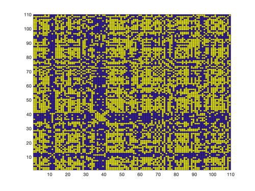

A project aimed to modelling and investigating complete pattern of interconnections in the brain.

- Explored the graph properties of connectomes

- Determined how they are affected by certain parameters

– Investigated structural-functional connectomes relationship by predicting direct and indirect weights

– Authored a scientific report with a comprehensive analysis of the research

- Delivered a professional presentation